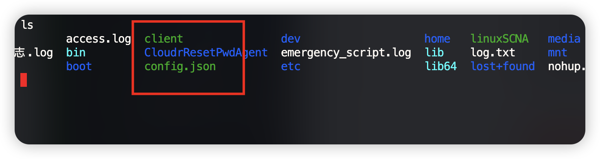

# LInux 监控工具	

​	 0Day漏洞一直是攻击者的大杀器，无任何有效的防御手段，故在有0Day漏洞时，攻击者很大概率会使用0Day漏洞来攻击防守方。但经分析不管攻击方是否使用0day攻击方最终目标都是服务器权限或者服务器数据，实现的攻击方式都是常见的，如注入、代码执行、文件上传、未授权访问、未授权下载或弱口令、钓鱼等常见攻击，0day只是之前未发现的漏洞点，漏洞类型还是这些，那么我方将在服务器层对这些攻击进性行为监测，当攻击者通过0day拿下服务器时就会产生行为，如执行命令、获取数据或者横向扩展都会产生大量行为，那么我方将采取对服务器层实时行为监控实现快速有效阻断0day或者攻击行为。


# 使用方式

## 服务端

```
服务端用于接收告警信息

./server 运行即可
```

## agent

```go
./clice 
注意需要下载config文件用于指定监控的路径、和服务端IP、和apikey
格式如下
{
  "server_url": "http://localhost:8080/alert",
  "monitor_path": "/path/to/monitor",
  "threatbook_api_key": "your_threatbook_api_key_here"
}

```


